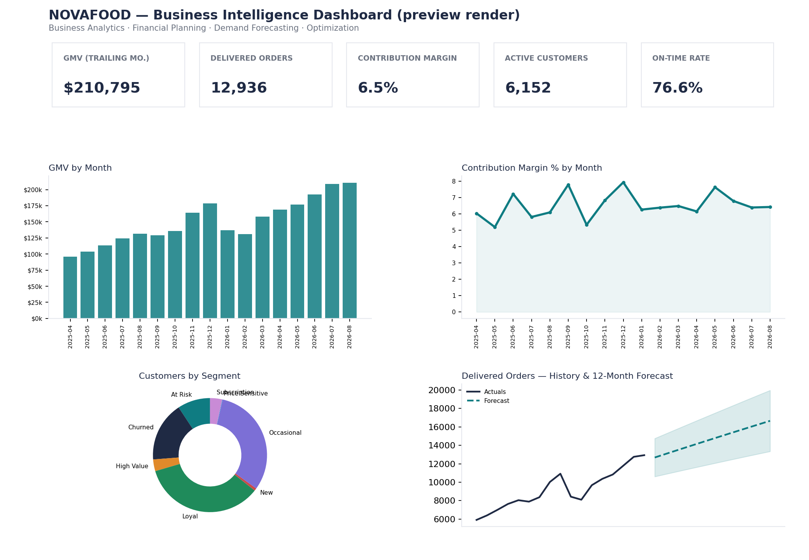

# Delivery Marketplace Analytics Engine

### NOVAFOOD Case Study — End-to-End Business Analytics, Financial Modeling, Demand Forecasting & Optimization

> Synthetic data, real methodology. This project simulates a food-delivery
> marketplace end to end — from an order-level ledger to a management
> decision — using the same techniques (rolling-origin forecast validation,
> constrained optimization, cohort/RFM analysis, driver decomposition) an
> analytics team would use on real data. It is not affiliated with, and does
> not use data from, Snapfood, SnappFood, DoorDash, Uber Eats, Deliveroo, or
> any real company.


*Faithful preview render generated from the project's own data pipeline (see [Dashboard preview](#dashboard-preview) below) — open `dashboard/index.html` for the live, interactive version.*

## Executive Summary

NOVAFOOD is a fictional online food-delivery marketplace operating across 8
cities. Delivered orders have grown ~65% annualized over a 17-month history,
but contribution margin has stayed thin (~6-7% of platform revenue) and is
negative in at least one city. This repository answers the central question
management actually asked:

> **Can NOVAFOOD grow orders while improving contribution profit?**

...by building the full analytics stack: KPI model → financial P&L → unit
economics → cohorts/RFM → restaurant/rider performance → 12-month demand
forecast (with proper time-series validation) → scenario planning → a
promotion-budget optimization → and a management-facing dashboard + Excel
workbook.

## Business Problem

NOVAFOOD's leadership wants five questions answered:

1. Which cities, segments, restaurants, and zones drive *profitable* growth?
2. Why is revenue growing faster or slower than contribution profit?
3. Which operational factors are eroding unit economics?
4. How much demand should we expect over the next 12 months?
5. What should management actually do — where to invest, where to cut?

See [`docs/business_case.md`](docs/business_case.md) for the full framing,
including the specific executive target modeled
(+25% annual order growth, +2pp contribution margin).

## Dataset

Synthetic, reproducible (fixed NumPy seed), and internally consistent — every
financial field is derived from the same order-level economics, not random
noise. See [`docs/data_dictionary.md`](docs/data_dictionary.md) for the full
schema and [`docs/assumptions.md`](docs/assumptions.md) for every hardcoded
parameter.

| | |
|---|---|
| Orders | ~167,000 |
| Customers | 12,000 |
| Restaurants | 320 |
| Riders | 520 |
| Cities / Zones | 8 / ~39 |
| History | 17 months (Apr 2025 – Aug 2026) |

**Scope note:** the original brief called for 300k+ orders / 30k+ customers.
This build uses a smaller-but-still-large scale so the *entire* pipeline —
generation → analytics → forecasting → optimization → Excel → dashboard —
actually runs end to end in a normal environment in well under a minute.
Every generator is a pure function of an N and a seed
(`src/data_generation/generate.py::generate_all`), so scaling up is a one-line
change if you want a bigger dataset.

## Architecture

```
DATA GENERATION → VALIDATION → KPI/FINANCE → COHORTS/RFM → FORECASTING
   → SCENARIOS → OPTIMIZATION → EXCEL WORKBOOK + HTML DASHBOARD
```

```
delivery-marketplace-analytics-engine/
├── src/
│   ├── data_generation/   # synthetic data generator (numpy/pandas, seeded)
│   ├── data_processing/   # customer enrichment, segmentation, cohorts, RFM
│   ├── finance/            # P&L, unit economics, margin driver decomposition
│   ├── forecasting/        # rolling-origin model validation + selection
│   ├── optimization/       # promo-budget allocation (SciPy trust-constr)
│   ├── analytics/          # strategic growth-vs-margin plan
│   └── dashboard/, reporting/
├── scripts/
│   ├── run_pipeline.py         # generate → validate → analyze → save
│   ├── build_excel.py          # NOVAFOOD_Business_Analytics.xlsx
│   └── build_dashboard_data.py # dashboard/data/novafood_data.js
├── dashboard/index.html    # self-contained HTML dashboard (Plotly)
├── data/{raw,processed}/   # generated at build time (gitignored)
├── outputs/{excel,reports,dashboard}/
├── tests/                  # pytest — 22 tests
├── docs/                   # business case, data dictionary, methodology
└── .github/workflows/      # CI (tests) + GitHub Pages deploy
```

## Tech Stack

Python (NumPy, pandas, SciPy, statsmodels, openpyxl, matplotlib), pytest,
Plotly.js (CDN, no build step), GitHub Actions.

## Key KPIs

GMV, delivered orders, platform revenue, contribution profit & margin %, AOV,
active/new/repeat customers, on-time delivery rate, cancellation rate,
LTV : CAC by channel, cohort retention. Full list and formulas in
[`docs/data_dictionary.md`](docs/data_dictionary.md) and the workbook's
`KPI_Definitions` sheet.

## Financial Model

A contribution-margin marketplace P&L (GMV → net customer spend → platform
revenue → contribution profit), unit economics by city/segment/channel, and a
margin-driver decomposition. See
[`docs/financial_model.md`](docs/financial_model.md).

## Customer Analytics

Rule-based segmentation (not random labels) from realized recency/frequency/
monetary behavior and subscription status, RFM scoring, monthly cohort
retention, and LTV:CAC by acquisition channel.

## Operations Analytics

Rider-level on-time rate, delivery time, and cancellation rate; restaurant
revenue-vs-margin quadrant classification (Star / Volume Trap / Niche Profit /
Review).

## Forecasting

Three models (seasonal naive, moving average, Holt-Winters) compared via
**rolling-origin (temporal) validation** — never a random train/test split on
time series — and selected per metric by WAPE. See
[`docs/forecasting_methodology.md`](docs/forecasting_methodology.md).

**Result in this dataset:** Holt-Winters wins for every metric (orders, GMV,
revenue, contribution profit) at ~12-14% WAPE, versus ~15-20% for moving
average and ~36-41% for seasonal naive — the series has both trend and
monthly seasonality that only Holt-Winters captures. Exact numbers are
recomputed on every pipeline run in
`data/processed/forecast_model_selection.json`.

## Scenario Planning

Base / Upside (+12%) / Downside (−15%) contribution-profit scenarios built
around the selected forecast, plus the strategic plan model for the "+25%
orders, +2pp margin" executive target (verdict, required lever sizes, and
feasibility check) — see [`docs/financial_model.md`](docs/financial_model.md).

## Optimization

A promotion budget is reallocated across city × customer-segment cells to
maximize incremental contribution profit under a fixed budget, a per-cell
floor, and a per-cell cap, solved with `scipy.optimize` (`trust-constr`).
See [`docs/optimization_methodology.md`](docs/optimization_methodology.md).

## Dashboard Preview

No live browser is available in this build environment to capture an actual
screenshot, so `docs/screenshots/make_preview.py` composes a preview image
from the *same real pipeline output* (matplotlib) — it's a faithful render of
the real numbers, not a mockup. Open `dashboard/index.html` for the live,
interactive Plotly version with all 7 sections (Executive Overview,
Financial, Customers & Retention, Restaurants, Operations, Forecast &
Planning, Scenario & Optimization).

## Key Findings

Calculated from the dataset by `scripts/run_pipeline.py::compute_findings`
(see `outputs/reports/key_findings.json` for the live numbers after you run
the pipeline) — not hand-written:

- Highest- and weakest-margin cities, by realized contribution margin %
- Highest contribution-profit-per-order customer segment
- Best LTV:CAC acquisition channel
- Annualized order growth rate
- Strategic-plan feasibility verdict for the +25%/+2pp target
- Promotion-budget optimization's incremental profit gain vs. an even split

## Business Recommendations

Generated from the analysis, not generic advice:

- **Reduce blanket discounting** in low-LTV:CAC channels (Paid Search) and
  redirect budget toward Organic/Referral and Push/CRM, which show the
  strongest LTV:CAC.
- **Prioritize operational review** in the weakest-margin city — negative
  contribution margin there is a structural issue (high rider cost per km,
  high cancellation), not a one-off.
- **Renegotiate or de-prioritize "Volume Trap" restaurants** (high GMV, low
  margin) in commission or delivery-cost terms; protect "Star" restaurant
  relationships.
- **Combine levers, don't rely on growth alone**, to hit the +25%-orders /
  +2pp-margin target — see the strategic plan verdict for the specific
  combination the model finds feasible.

## How to Run

```bash
python -m venv .venv && source .venv/bin/activate   # or .venv\Scripts\activate on Windows
pip install -r requirements.txt

python scripts/run_pipeline.py          # generate data + run all analytics
python scripts/build_excel.py           # -> outputs/excel/NOVAFOOD_Business_Analytics.xlsx
python scripts/build_dashboard_data.py  # -> dashboard/data/novafood_data.js

pytest tests/ -v                        # 22 tests

open dashboard/index.html               # or just double-click it — no server needed
```

## Data Dictionary

See [`docs/data_dictionary.md`](docs/data_dictionary.md).

## Methodology

See [`docs/forecasting_methodology.md`](docs/forecasting_methodology.md) and
[`docs/optimization_methodology.md`](docs/optimization_methodology.md).

## Model Validation

Rolling-origin validation results (WAPE, MAPE, RMSE, bias per candidate
model) are written to `data/processed/forecast_model_selection.json` on every
pipeline run, and summarized on the dashboard's Forecast section and in the
workbook. Optimization convergence is checked explicitly
(`optimization_summary.json: "converged": true`) rather than assumed.

## Limitations

- Synthetic data: realistic *relationships*, not real observed behavior —
  treat findings as a methodology demonstration, not a real NOVAFOOD.
- Scale reduced from the original 300k-orders brief for build-time
  reasons (see "Scope note" above); the generator scales up with no code
  changes.
- The margin-driver decomposition is a first-order linear approximation, not
  a formal Shapley/Oaxaca-Blinder split (documented in
  `docs/financial_model.md`).
- Prediction intervals are a simplified residual-based band, not a full
  state-space or bootstrap interval (documented in
  `docs/forecasting_methodology.md`).
- CAC by channel is a stated assumption for the LTV:CAC analysis, not
  observed spend data (documented in `docs/assumptions.md`).

## Future Improvements

- Swap in a gradient-boosted or Prophet-style model and compare against the
  current Holt-Winters baseline.
- Extend the optimization to a multi-period (rolling budget) formulation.
- Add a restaurant-menu-level (SKU) analysis layer.
- Wire the dashboard to a live data source instead of a static JS payload.

## How to Publish

```bash
./publish.sh     # macOS/Linux, requires `gh` (GitHub CLI) authenticated
publish.bat      # Windows
```

Both scripts init git, create the GitHub repo, push, set topics, and enable
GitHub Pages (served from `dashboard/` via the included Actions workflow).

## Publishing the Dashboard with GitHub Pages

Handled automatically by `.github/workflows/pages.yml` on every push to
`main` that touches `dashboard/**` — no manual `docs/index.html` step needed.
Once enabled, the dashboard is live at
`https://<your-username>.github.io/delivery-marketplace-analytics-engine/`.

## About the Author

**Milad Shabani** — Business Intelligence | Data Analytics | Data Engineering
[miladshabani.ir](https://miladshabani.ir) ·
[github.com/Milad-Shabani](https://github.com/Milad-Shabani)
